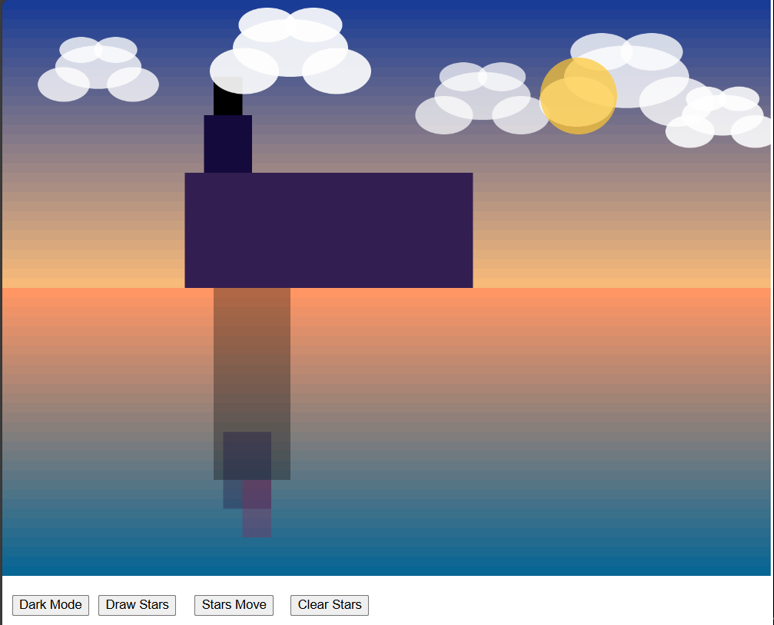

# 9103-FinalWork
 
# Instructions for Use

### 1. Load Page
Once the artwork has loaded, you will see a static Bauhaus style scene with a sky, buildings, clouds, water, and the sun.

### 2. Enable Night Mode
Click the **"Dark Mode"** button at the bottom of the page to watch the scene gradually change from day to night, with the sun disappearing and the moon appearing, accompanied by a gradual darkening of the environment.

### 3. Draw Stars
Click the **"Draw Stars"** button to create stars in the night sky. The position of the stars will be randomly distributed around the moon.

### 4. Stars Move
Click the **"Stars Move"** button, and the stars will start to rotate around the moon. Some of the stars will draw trajectories during the movement to create vivid effects.

### 5. Clear Stars
Click the **"Clear Stars"** button, and the stars along with their tracks will be removed, resetting the scene to its original state.

---

# Individual Part Information

### 2.1 User Input
I chose to focus on **User Input**.

### 2.2 Differences from Other Group Members
- I focused mainly on the button interactions.
- I also generated the animated transitions for the night mode, added the new element **star**, and its associated buttons and animation effects.

### 2.3 Code Inspiration
The stars were inspired by my **quiz5**:
- I got a high score for that quiz.
- This part of the tutorial also talks about using buttons to generate animations or interactions.

# 2.4 A Short Technical Note

## Commit 1: Add a Dark Mode Button
I created a sun-to-moon day/night transition effect to animate the scene.

- **Gradual Change of Sky and Water**: The code animates the gradual darkening by using the `lerpColor()` function. As the sun sinks, the color of the sky and water gradually changes to dark blue.
- **Sun to Moon Transition**: The code controls the change in the position and color of the sun through interpolation functions and adds the moon object to the scene at the end of the animation.
- **Fading of Clouds**: During the course of the night, the clouds in the sky fade out. The code accomplishes this effect by changing the transparency of the clouds (`setAlpha()`).
- **Animation Control**: The animation is implemented using `requestAnimationFrame()`. The `progress` variable is used to control the animation within 5 seconds.

## Commit 2: Layering Pattern for Moon Appearances
In this version (commit 2), I've introduced a layering pattern for the moon's appearances to maintain the overall Bauhaus style visualization. Compared to the first commit (commit 1), I've enhanced the gradient layering of colors in the moon appearances instead of monotonously darkening everything.

### Main Changes:
1. **applyLayeredDarkMode() Function**:
   - The `applyLayeredDarkMode()` function is called after the moon has appeared to ensure that the image remains Bauhaus-style after the sun has completely disappeared and the moon has appeared.
   - This function recalculates the gradient for the sky and water, increasing the number of color layers.

2. **Layering Adjustments for Sky and Water**:
   - The sky and water colors were recalculated using the `lerpColor()` method when the moon appeared. The sky color transitions to a darker blue, and the water surface is treated the same as the sky, consistent with Bauhaus style aesthetics.

## Commit 3: More Interactive Buttons and Star Effects
**Overview**: Added more interactive buttons, star drawing and movement effects, and a reset function.

### Major Changes:
1. **Star Drawing and Movement**:
   - Added `drawStars()` and `startStarMovement()` functions.

2. **New Buttons**:
   - Introduced new buttons: **"drawStars"**, **"starMovement"**, and **"clearStars"** with their corresponding functions.

3. **Star Drawing**:
   - The `drawStars()` function in commit 3 is responsible for generating 1000 stars around the moon, each positioned using a random angle and radius. The stars are added to the scene.

4. **Star Movement**:
   - The `startStarMovement()` function in commit 3 animates the stars around the moon. Each star moves in a track, and some of the stars leave line trails as they move.

